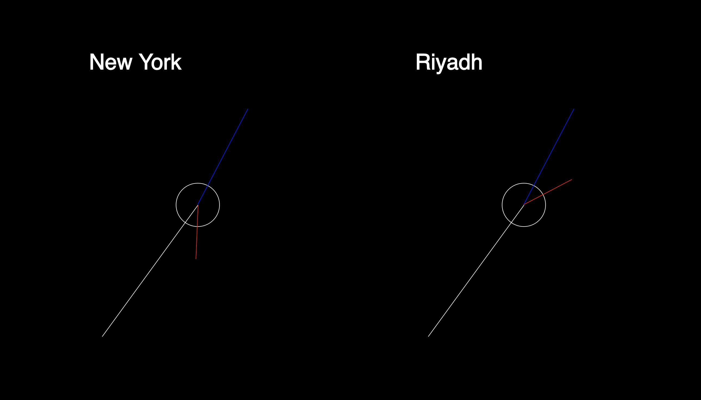

# clock.js
A javascript library for *drawing with time*

This library allows you to create visuals with time by finding the appropriate degree angle for hours, minutes, and seconds.

Example:
`Clock("EST").secondHand` //will return the angle of the second hand at this moment for Eastern Standard Time (it accounts for Daylight Savings)

Options:
Takes 2 options,
1. the abbreviated timezone as a string (if none is provided it will default to the client's local time).
2. whether or not you want a smooth second hand or a stoccato second hand (takes true or false, default is false).

